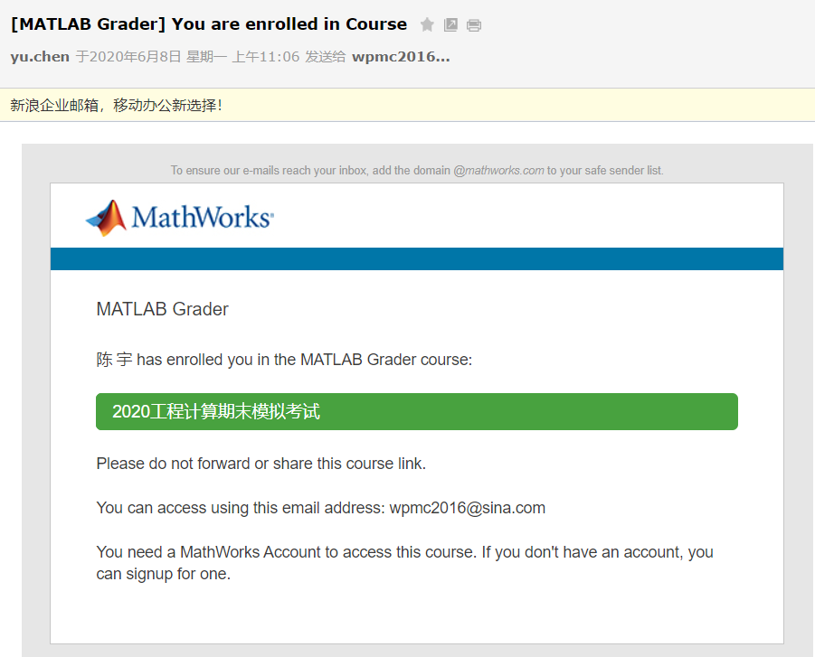
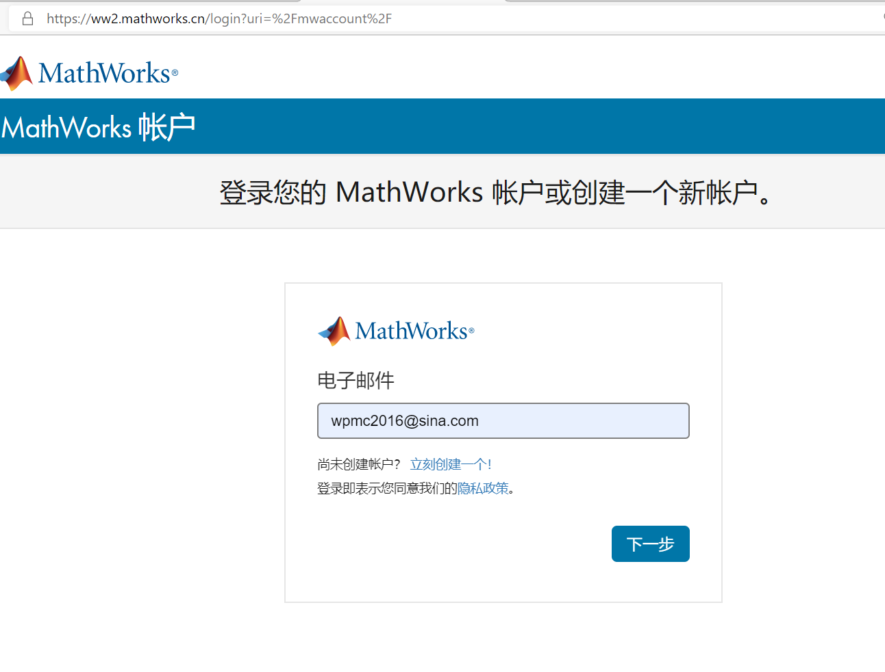
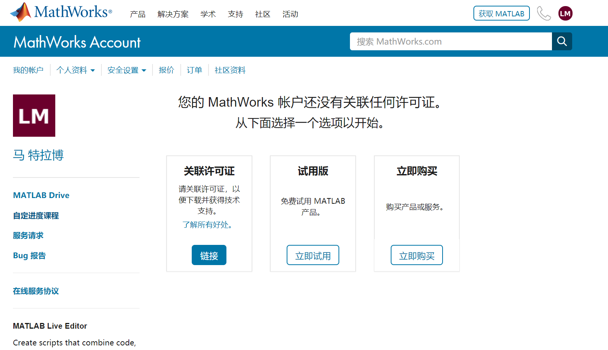
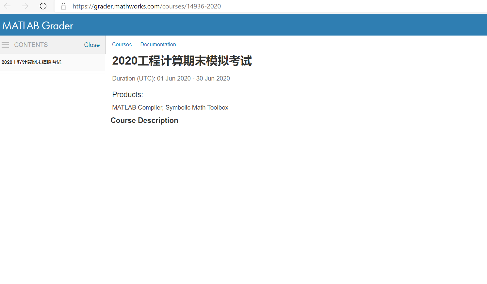

# 期末考试时间

时间：2020年6月20日，上午9点到11点。

地点：腾讯会议，会议ID是895 331 860，会议密码：0620

# 期末考试流程

一、注册一个邮箱（可以是任何邮件服务提供商，北邮邮箱最好，因为可以自动获得MATLAB License，用于安装最新版本的Matlab）。测试账号：[wpmc2016@sina.com](mailto:wpmc2016@sina.com) 

二、用步骤一的邮箱到 https://ww2.mathworks.cn/login 注册一个Matlab账号，将Matlab账号告诉助教。以下是测试Matlab账号：

1. 用户名：[wpmc2016@sina.com](mailto:wpmc2016@sina.com) 

2. 密码：,Qd5_$L.Kx=e}HmR

三、在考前，你会收到一封来自Mathworks公司的邮件，邮件标题为``[MATLAB Grader] You are enrolled in Course``。邮件内容如下截图

四、开启任意浏览器（微软Edge，火狐等），进入考场的方式如下：

1. ``在浏览器地址栏输入个人邮箱地址（不通过VPN或者任何方式）``，查看该邮件，并点击邮件中的绿色按钮，进入考场。

五、进入考场的时候，需要输入Matlab账号和密码，如下图所示：

六、当输入完用户名和密码之后，会显示如下画面：

七、最后，再次点击邮件中的绿色按钮，进入考场，会出现如下画面：

八、开启``后机位的手机摄像头``，进入腾讯会议，会议ID是895 331 860，会议密码：0620

九、将自己的会议ID名字设为**学号-姓名**

